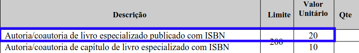
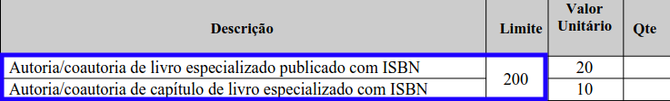
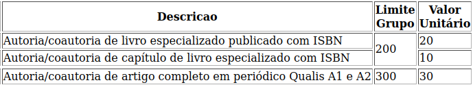
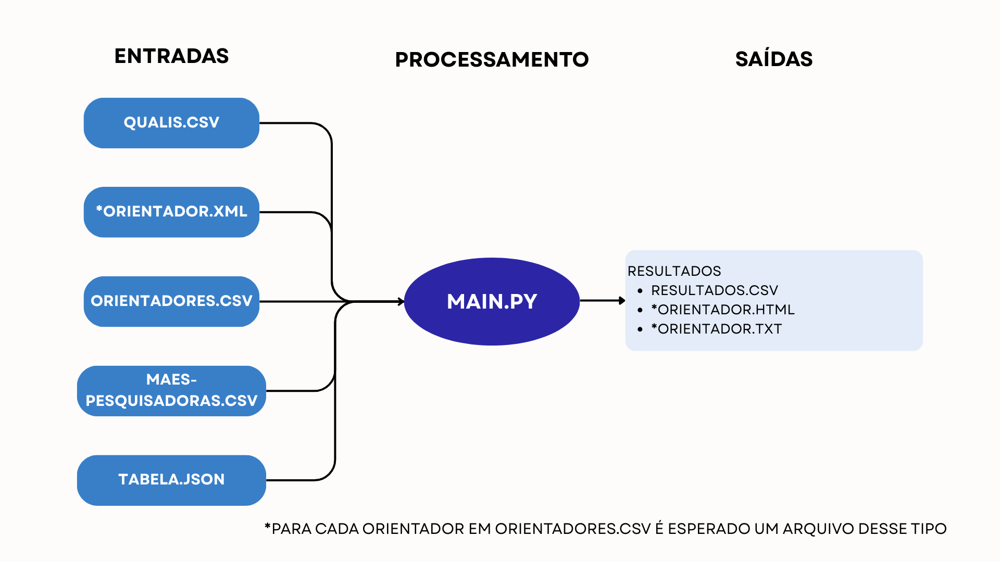
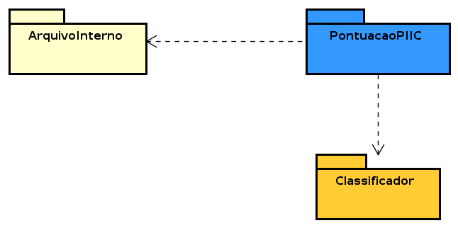
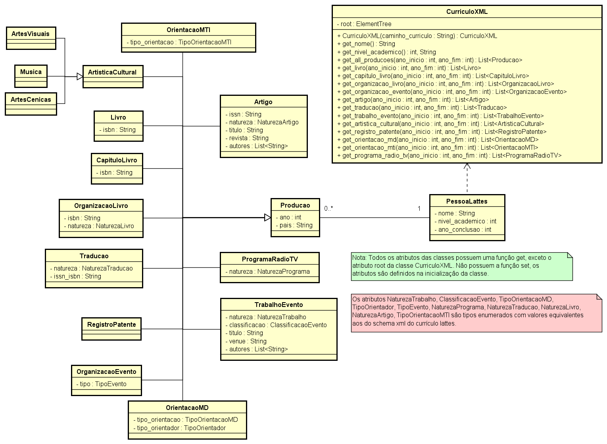
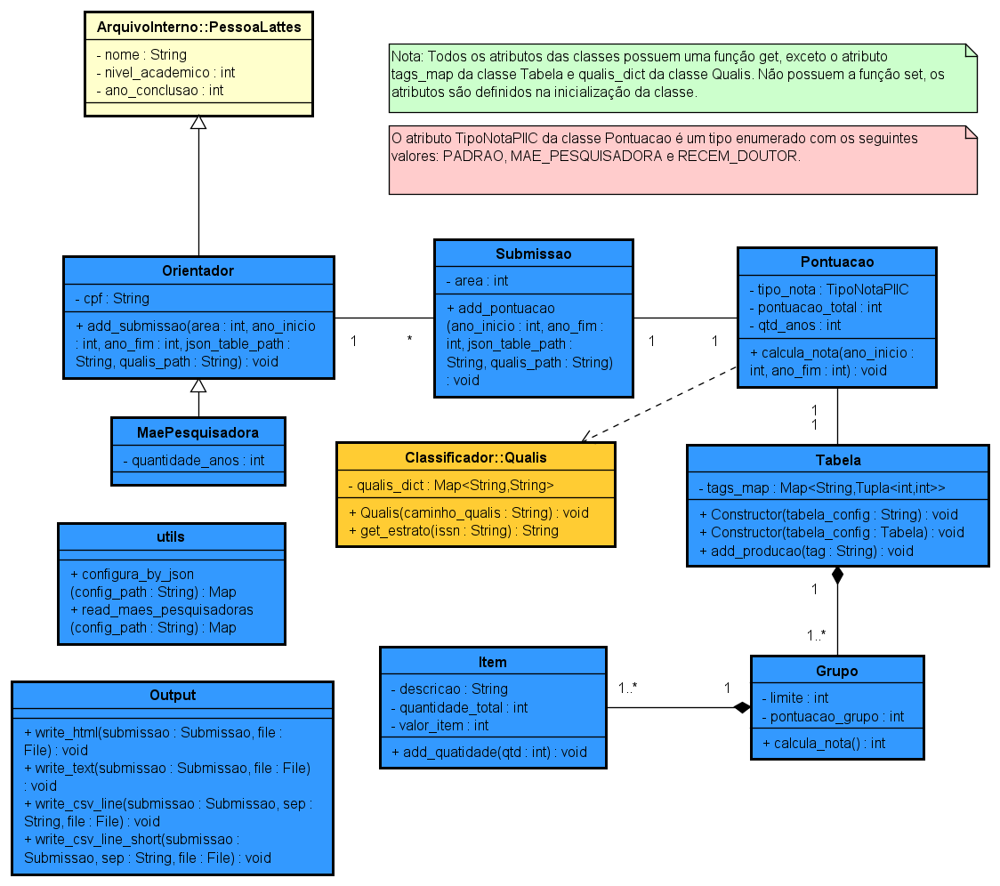
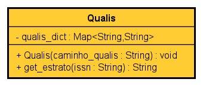

# Calculo Nota A - Módulo PIIC

Sistema de cálculo automatizado da nota A por análise do xml do currículo lattes utilizado no edital PIIC da PRPPG.

## Conteúdo

- [Como Executar](#como-executar)
- [Requisitos Para Execução](#requisitos-para-execução)
- [Saída](#saída)
- [Detalhamento das Entradas](#detalhamento-das-entradas)
    - [Arquivo de Configuração](#arquivo-de-configuração)
    - [Arquivo Orientadores](#arquivo-orientadores)
    - [Arquivo maes-pesquisadoras](#arquivo-maes-pesquisadoras)
    - [Diretório dos Currículos](#diretório-dos-currículos)
    - [Arquivo Qualis](#arquivo-qualis)
    - [Tabela de configuração](#tabela-de-configuração)
- [Visão Geral](#visão-geral)
- [Diagrama de Pacotes](#diagrama-de-pacotes)
- [Diagramas de Classe](#diagramas-de-classe)
    - [ArquivoInterno](#arquivointerno)
    - [PontuacaoPIIC](#pontuacaopiic)
    - [Classificador](#classificador)
____

## Como Executar

O comando de execução **deve ser realizado no terminal na pasta PIIC** do projeto, seguindo o padrão a seguir:

```
<comando-de-execução-python> main.py <arquivo-de-configuracao> [-n]
```

**<comando-de-execução-python>**: Esse comando depende do sistema e de como o python foi instalado. No linux (Ubuntu) normalmente é **python3** e no windows **python**.

**Nota**: -n é uma flag que modifica a saída padrão do csv para uma saída atualizada que acrescenta o tipo do pesquisador e retira os campos que ficam sem informação na saída padrão do csv.


### Requisitos Para Execução:

- Instalar as bibliotecas necessárias com o comando ```pip3 install -r requirements.txt```. O arquivo **requirements.txt** está na raiz do projeto.

- O [**arquivo-de-configuracao**](#arquivo-de-configuração) (exemplo na pasta DadosPIIC) deve ser passado na entrada com as informações necessárias para a execução do programa. **OBS:** Como o programa será executado na pasta **PIIC** os caminhos devem ser realtivos a essa pasta.

- O arquivo de configuração precisa das seguintes informações:

    - Arquivo com a lista de orientadores [(mais informações)](#arquivo-orientadores).
    - Arquivo maes-pesquisadoras. [(mais informações)](#arquivo-maes-pesquisadoras)
    - Diretório com os currículos Lattes de cada orientador. [(mais informações)](#diretório-dos-currículos)
    - Arquivo Qualis. [(mais informações)](#arquivo-qualis)
    - Tabela de configuração. [(mais informações)](#tabela-de-configuração)

## Saída

- Um arquivo **cpf-do-orientador.html** para cada orientador na lista de orientadores contendo seus resultados.

- Um arquivo **cpf-do-orientador.txt** para cada orientador na lista de orientadores contendo seus resultados.

- Um arquivo **resultados.csv** com os resultados obtidos de todos os orientadores.

**Nota:** As saídas serão armazenadas no diretório especificado no arquivo de configuração.

## Detalhamento das Entradas

Detalhes do que é esperado em cada arquivo de entrada.

### Arquivo de Configuração

É um arquivo json com as informações necessárias para calcular as notas.

| tag | Informação esperada |
|-----|-----|
| "ano_inicio" | Ano inicial para considerar as produções. |
| "ano_fim" | Ano final para considerar as produções. |
| "diretorio_resultados" | Caminho para a pasta na qual os resultados serão salvos. |
| "arquivo_orientadores" | Caminho para o arquivo com a lista de orientadores. [(mais informações)](#arquivo-orientadores)|
| "arquivo_maes_pesquisadoras" | Caminho para o arquivo mae-pesquisadoras. [(mais informações)](#arquivo-maes-pesquisadoras)|
| "diretorio_dos_curriculos" | Caminho para a pasta com os currículos dos orientadores. [(mais informações)](#diretório-dos-currículos)|
| "arquivo_qualis" | Caminho para o arquivo qualis-capes. [(mais informações)](#arquivo-qualis)|
| "tabela_de_configuracao" | Caminho para o arquivo da tabela de configuração. [(mais informações)](#tabela-de-configuração)|

### Arquivo Orientadores

Um arquivo em formato **csv** com uma primeira coluna **cpf** e com uma segunda coluna **área**.


|cpf|área|
|-----|-----|
|00011122233|102|
|44455566677|102|

- **cpf**: cpf do orientador a ser considerado.

- **área**: código da área de atuação do orientador.

______

### Arquivo maes-pesquisadoras

Um arquivo em formato **csv** com uma primeira coluna **cpf**, uma segunda coluna **limite** e uma terceira coluna **anos**.

|cpf|limite|anos|
|-----|-----|-----|
|00011122233|2019|4|
|44455566677|2019|4|

- **cpf**: cpf da mãe pequisadora.
- **limite**: o ano a partir do qual serão considerados para a contagem da pontuação.
- **anos**: o denominador do cálculo da média.
______

### Diretório dos Currículos

Uma pasta com os currículos Lattes de cada orientador em formato xml.

**Nota**: O **currículo Lattes** do orientador em formato **xml** que pode ser obtido na [Plataforma Lattes](https://lattes.cnpq.br/). O arquivo deve estar renomeado com o **cpf do orientador** a qual o currículo pertence.
______

### Arquivo Qualis

Um arquivo em formato **csv** com uma primeira coluna **ISSN** e uma segunda coluna **Estrato**. O arquivo qualis-unificado.csv é gerado através de um programa de pré-processamento contido na pasta QualisNovo. 

Esse arquivo é produzido apartir do arquivo obtido na [Plataforma Sucupira](https://sucupira.capes.gov.br/sucupira/public/consultas/coleta/veiculoPublicacaoQualis/listaConsultaGeralPeriodicos.jsf) com as classificações dos periódicos em todas as áreas. 


Além do arquivo da Plataforma Sucupira, também é utilizado um arquivo disponibilizado pela ferramenta [QLattes](https://github.com/nabormendonca/qlattes/tree/main/dist/data). Esse arquivo é utilizado para fazer associações de issn, um artigo pode ter dois issn: um print-issn e um e-issn. Ambos issn devem estar associados a um mesmo artigo e devem ser considerados no cálculo da nota.


|ISSN|Estrato|
|----|----|
|0000-0002|C|
|0000-000X|B3|

- **ISSN**: issn do periódico.
- **Estrato**: classificação do periódico segundo o **Qualis CAPES**.

______

### Tabela de configuração

Um arquivo **json** para configurar a tabela do edital no programa. O formato é baseado em uma lista de [**grupos**](#grupo), em que cada grupo possui a chave **limite** com o valor limite desse grupo e a chave [**itens**](#item) que é uma lista de itens que pertence a esse grupo. Um item possui a chave **descricao** que guarda a frase que descreve o item, a chave **valor** que é o valor unitário desse item e a chave **tags** que é uma lista de [tags](#tags) das quais o item está relacionado. [Exemplo de tabela](#exemplo-de-tabela).

#### Tags

As tags são os tipos de produção que o programa consegue considerar, assim a produção correspondente ao item deve ter sua tag adicionada a lista de tags do item. Um item pode estar relacionado a mais de uma produção diferente.

As tags atualmente previstas no programa são:

|Tag|Tipo de Produção|
|---|----------------|
"livro" | Autoria/coautoria de livro especializado publicado com ISBN 
"cap_livro" | Autoria/coautoria de capítulo de livro especializado com ISBN
"artigo_a1" | Autoria/coautoria de artigo completo em periódico Qualis A1
"artigo_a2" | Autoria/coautoria de artigo completo em periódico Qualis A2
"artigo_a3" | Autoria/coautoria de artigo completo em periódico Qualis A3
"artigo_a4" | Autoria/coautoria de artigo completo em periódico Qualis A4
"artigo_b1" | Autoria/coautoria de artigo completo em periódico Qualis B1
"artigo_b2" | Autoria/coautoria de artigo completo em periódico Qualis B2
"artigo_b3" | Autoria/coautoria de artigo completo em periódico Qualis B3
"artigo_b4" | Autoria/coautoria de artigo completo em periódico Qualis B4
"artigo_c" | Autoria/coautoria de artigo completo em periódico Qualis C
"artigo_nc" | Autoria/coautoria de artigo completo em periódico que não conste no Qualis CAPES
"trabalho_inter" | Autoria/coautoria de trabalho completo em eventos científicos/artísticos internacionais
"trabalho_nac" | Autoria/coautoria de trabalho completo em eventos científicos/artísticos nacionais
"resumo_inter" | Resumo em evento científico - internacional
"resumo_nac" | Resumo em evento científico - nacional, regional ou localartístico-cultural - nacional
"organizacao_livro" | Organização de livro especializado com ISBN/ISSN
"organizacao_evento" | Organização de eventos, congressos, exposições, feiras ou olimpíadas
"traducao_livro" | Tradução de livro especializado com ISBN
"prod_tecnica" | Produção técnica como registro/deposito de patente ou cultivar
"musica" | Música
"artes_cenicas" | Artes cênicas
"artes_visuais" | Artes visuais
"outra_artistica" | Outra produção artística-cultural
"programa_radio_tv" | Entrevistas, mesas redondas, programas e comentários na mídia
"orientacao_doutorado" | Orientação de tese de doutorado defendida e aprovada
"orientacao_mestrado" | Orientação de dissertação de mestrado defendida e aprovada
"coorientacao_doutorado" | Coorientação de tese de doutorado defendida e aprovada
"coorientacao_mestrado" | Coorientação de dissertação de mestrado defendida e aprovada
"orientacao_monografia" | Orientação de monografia de curso de aperfeiçoamento/especialização
"orientacao_tcc" | Orientação concluída de trabalho de conclusão de curso de graduação
"orientacao_ic" | Orientação concluída de iniciação científica

#### Item

Um item pode ser visto como uma linha da tabela.



A linha destacada acima pode ser representada como um item da seguinte forma no json:

```
{
    "descricao": "Autoria/coautoria de livro especializado publicado com ISBN",
    "valor": 20,
    "tags": ["livro"]
}
```

#### Grupo

Um grupo pode ser visto como o conjunto de linhas da tabela que tem o mesmo limite.



O grupo acima pode ser representado no json da seguinte forma:

```
{
    "limite": 200,
    "itens": [
        {
            "descricao": "Autoria/coautoria de livro especializado publicado com ISBN",
            "valor": 20,
            "tags": ["livro"]
        },
        {
            "descricao": "Autoria/coautoria de capítulo de livro especializado com ISBN",
            "valor": 10,
            "tags": ["cap_livro"]
        }
    ]
}
```

#### Exemplo de Tabela



A tabela acima pode ser representada da seguinte forma no arquivo json:

```
[
    {
        "limite": 200,
        "itens": [
            {
                "descricao": "Autoria/coautoria de livro especializado publicado com ISBN",
                "valor": 20,
                "tags": ["livro"]
            },
            {
                "descricao": "Autoria/coautoria de capítulo de livro especializado com ISBN",
                "valor": 10,
                "tags": ["cap_livro"]
            }
        ]
    },
    {
        "limite": 300,
        "itens": [
            {
                "descricao": "Autoria/coautoria de artigo completo em periódico Qualis A1 e A2",
                "valor": 30,
                "tags": ["artigo_a1", "artigo_a2"]
            }
        ]
    }
]
```
______

## Visão Geral

Diagramas que servem para entender melhor a organização do programa. O arquivo .asta, extensão do programa(Astah) que foi utilizado para modelar os diagramas, se encontra da pasta docs.



## Diagrama de Pacotes



## Diagramas de Classe

### ArquivoInterno

As classes de produção e seus tipos enumerados foram baseados no schema xml disponível no site da plataforma lattes. O schema xml(.XSD atualizado em 12/09/2022) que define o xml do currículo lattes está na pasta docs. [Link da plataforma lattes](https://www.lattes.cnpq.br/), para acessar o schema xml basta ir na guia EXTRAÇÃO DE DADOS do site.



### PontuacaoPIIC




### Classificador

